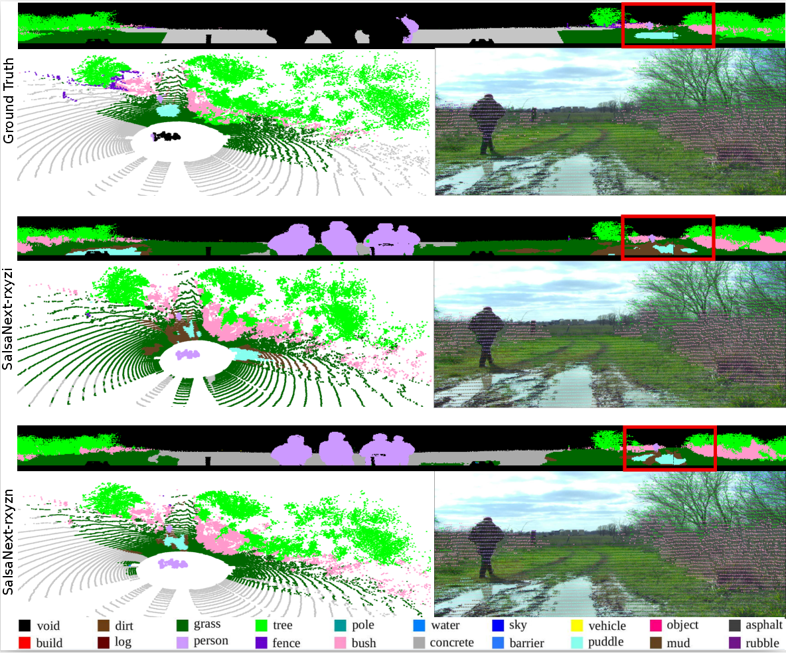
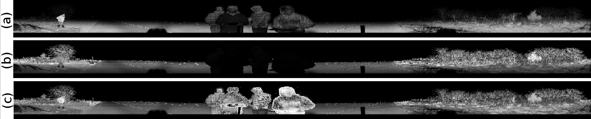
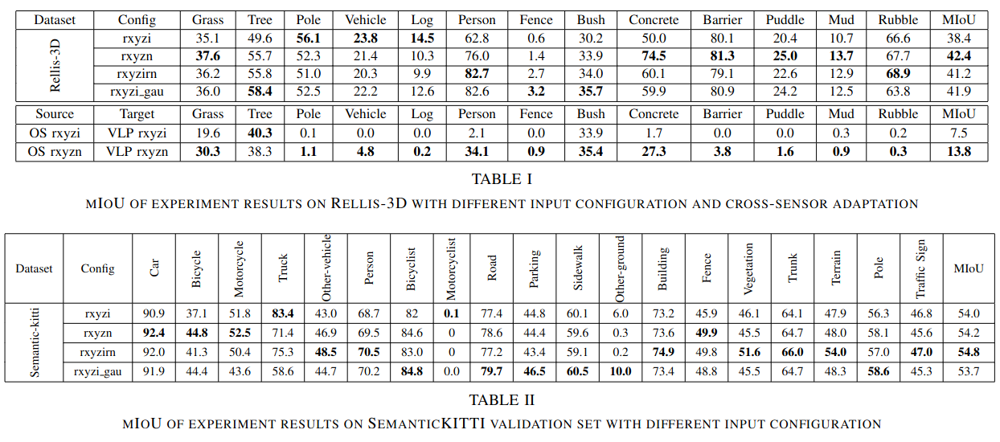

## Reflectivity is All You Need!: Advancing LiDAR Semantic Segmentation
[[Paper]](https://arxiv.org/abs/2403.13188)
### Summary

##### This repository explores the benefits of incorporating calibrated intensity (reflectivity) in learning-based LiDAR semantic segmentation frameworks. By leveraging reflectivity alongside raw intensity measurements, our model exhibits improved performance, particularly in off-road scenarios.


*rxyzi* represents model trained on raw intensity data. *rxyzn* represents model trained on reflectivity data.

### Generating reflectivity data
Generate reflectivity data for Rellis-3D: 
```
python utils/data_generator.py
```
Modify the dataset and output file path.

Data generators for Semantic-Kitti and Semantic-POSS can be found in */utils*.

#### Modified Rellis-3D dataset used for training and testing. [Download.](https://drive.google.com/file/d/1nWOecnBa6WugoBl-JnFZzV2s9ogXnZw_/view?usp=sharing) 


(a) Illustrates spherical projection of LiDAR with raw intensity as pixel values. (b) Calibrated for *range* and *angle of incidence*. (c) Calibrated for *range*, *angle of incidence* and *near-range effect*. 

### SalsaNext
Original [Salsanext](https://github.com/TiagoCortinhal/SalsaNext) and modified versions config files can be found in:
```
cd ./train/tasks/semantic/config/arch
```
The modified versions of salsanext mentioned in paper is:
```
salsanext_rxyzi.yml
salsanext_rxyzirn.yml
salsanext_rxyzn.yml
early_ga_detach.yml (*learning reflectivity*)
```


### Evaluate SalsaNext

#### Download Pretrained models.[Google Drive.](https://drive.google.com/file/d/1RxsLVhq5ZFLj9q8AydaPOsM4DpwwrL9K/view?usp=sharing)

Make sure you have installed all the python dependencies.
```
pip install -r ./requirements.txt
```
Inorder to evaluate Salsanext:
```
bash run_salsanext_eval.sh 
```
Edit the paths for dataset and pretrained models in *evaluate.sh*



#### There are several helpers and utilities in */utils*.

### Related Research


### Citation

```
@misc{viswanath2024reflectivity,
      title={Reflectivity Is All You Need!: Advancing LiDAR Semantic Segmentation}, 
      author={Kasi Viswanath and Peng Jiang and Srikanth Saripalli},
      year={2024},
      eprint={2403.13188},
      archivePrefix={arXiv},
      primaryClass={cs.CV}
}
```
